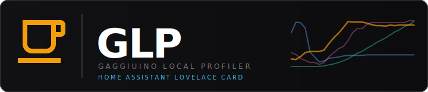
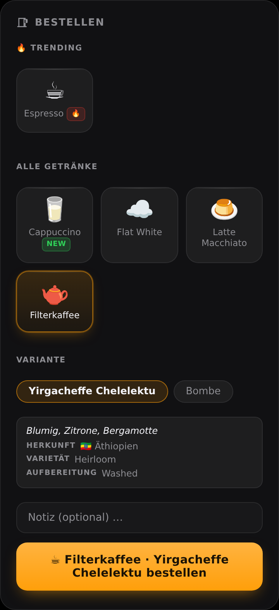

<p align="center">
  
</p>

<p align="center">
  <a href="https://github.com/mxkissnr/glp-order-card/releases">
    
  </a>
  <a href="https://github.com/mxkissnr/glp-order-card/actions/workflows/validate.yml">
    
  </a>
  
  
  
  
</p>

<p align="center">
  Customer-facing Lovelace card for ordering espresso via <a href="https://github.com/mxkissnr/gaggiuino-local-profiler">Gaggiuino Local Profiler</a>.<br/>
  Customers browse the menu, place an order and track its status in real time — all from a Home Assistant dashboard.
</p>

<p align="center">
  Part of the <a href="https://github.com/mxkissnr/gaggiuino-local-profiler">GLP ecosystem</a> — requires a <a href="https://gaggiuino.github.io/">Gaggiuino</a>-modified espresso machine and the GLP App.
</p>

---

## 📸 Screenshot

<p align="center">
  
</p>

Regenerated on demand via `node scripts/screenshot.mjs` (demo data, no real backend required).

---

## Prerequisites

- [Gaggiuino Local Profiler](https://github.com/mxkissnr/gaggiuino-local-profiler) app v1.45.0 or later, installed and running
- The barista configures the menu in the new **Bestellungen** tab in the GLP web UI

## Installation via HACS

1. In HACS → Frontend → ⋮ → Custom repositories → add `mxkissnr/glp-order-card` (category: **Lovelace**)
2. Download the card
3. Add a manual resource or let HACS handle it

## Configuration

Minimal — zero config needed in a standard HA setup:
```yaml
type: custom:glp-order-card
```

Full config (only needed for direct/external access):
```yaml
type: custom:glp-order-card
glp_url: http://homeassistant.local:8099   # optional — direct port URL (auto-detected via ingress)
switch_entity: switch.espresso_plug        # optional — auto-detected from GLP integration sensor
title: Bestellen                           # optional — card header title
```

### Options

| Option | Description | Default |
|---|---|---|
| `glp_url` | URL of the GLP app (port 8099). Only needed when accessing from outside HA or if auto-detection fails. | *(auto via ingress)* |
| `switch_entity` | HA switch entity for the machine. Auto-detected from the `machine_status` sensor attribute if the GLP integration is installed. | *(auto)* |
| `title` | Card header title | `Bestellen` / `Order` (auto-detected language) |
| `new_badge_days` | How many days newly added menu items show the NEW badge | `7` |

## How it works

1. The card loads the drink menu from the GLP app (`GET /api/orders/menu`)
2. For drinks backed by the coffee library, bean variants come from `GET /api/orders/active-beans` — only beans actually still in stock are offered, and selecting a bean shows its description (taste notes, origin with flag + localized country name, variety, processing) so the customer knows what characterizes the coffee
3. The customer selects a drink, optionally adds a note, and presses the order button
4. The order is submitted with the logged-in HA user's name as customer identifier
5. The card polls the order status every 10 seconds and updates automatically
6. When the barista accepts the order, the card shows the ETA countdown
7. When done, the card shows a "Ready!" confirmation
8. The customer can then place a new order

The barista manages orders from the **Bestellungen** tab in the GLP web UI.

## Languages

Auto-detected from the browser locale. Currently supported: 🇩🇪 DE, 🇬🇧 EN.

---

<p align="center">
  <a href="https://github.com/mxkissnr/gaggiuino-local-profiler/wiki">📖 Documentation (Wiki)</a> ·
  <a href="CHANGELOG.md">📋 Changelog</a> ·
  <a href="https://github.com/mxkissnr/gaggiuino-local-profiler">🔧 GLP App</a> ·
  <a href="https://github.com/mxkissnr/glp-lovelace-card">📊 GLP Shot Card</a> ·
  <a href="https://github.com/mxkissnr/glp-order-card/issues">🐛 Issues</a>
</p>

---

## License

GPL-3.0 © 2024–2026 mxkissnr — free to use, fork and modify; any derivative work must remain open source under the same license. Commercial use is not permitted.

## Acknowledgements

Built on top of the [Gaggiuino](https://gaggiuino.github.io/) project and the [Gaggiuino Local Profiler](https://github.com/mxkissnr/gaggiuino-local-profiler) app.

---

<p align="center">
  <sub>Built with <a href="https://claude.ai/code">Claude Code</a> by Anthropic — see <a href="https://github.com/mxkissnr/gaggiuino-local-profiler/blob/main/DEVELOPMENT.md">DEVELOPMENT.md</a> for full transparency and model stats.</sub>
</p>
